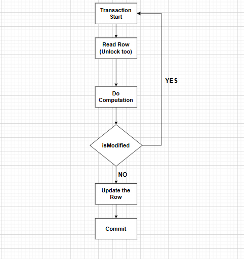

# Concurrency Control in Distributed Systems

#### Example: Let suppose there are three users who want to book seat in a theater at the same time.
User A, User B, and User C all try to book the last available seat simultaneously. Without proper concurrency control, it is possible that all three users could be allowed to book the same seat, leading to overbooking and confusion.

#### Solution 1: user Synchronization
to prevent this we can make Critical section as Synchronized. This means that only one user can access the booking system at a time. When User A is booking the seat, Users B and C must wait until User A has completed their booking before they can proceed.

**Question:** Will this work for Distributed Systems?. <br>
**Answer:** No as we can have multiple instance of booking system running on different servers.


#### Solution 2: Use Distributed Concurrency Control
**1. Optimistic Concurrency Control (OCC):**<br>
**2. Pessimistic Concurrency Control (PCC):**


But before Learning this we need to understand some basic terms.
1. What is the usage of Transaction
2. What is DB Locking
3. what are Isolation level presets


### 1. What is the usage of Transaction
Transaction help us to achieve Integrity. Means it help to avoid inconsistency in data. <br>

For Example: We have to Debit Money from Account A and Credit it to Account B. <br>

```
BEGIN_TRANSACTION:
    DEBIT(Account A, $100)
    CREDIT(Account B, $100)
    IF ALL_SUCESS:
        COMMIT_TRANSACTION
    ELSE:
        ROLLBACK_TRANSACTION
END_TRANSACTION
```

### 2. What is DB Locking
DB locking make sure that no other transaction can access the same data until the lock is released. <br>

Lock Type:
1. Shared Lock (Read Lock)
2. Exclusive Lock (Write Lock)

On Shared lock we can have another shared lock but no exclusive lock. <br>
On Exclusive lock we cannot have any other lock.


### 3. what are Isolation level presets
1. Read Uncommitted
2. Read Committed
3. Repeatable Read
4. Serializable

**Dirty Read:** When a transaction reads data that has been modified by another transaction but not yet committed. <br><br>
**Non-Repeatable Read:** When a transaction reads the same data multiple times and gets different results each time because another transaction has modified the data in between the reads. <br><br>
**Phantom Read:** When a transaction reads a set of rows that satisfy a certain condition, but another transaction inserts or deletes rows that would affect the result set of the first transaction if it were to read the data again


| Isolation Level   | Dirty Read | Non-Repeatable Read | Phantom Read |
|-------------------|------------|---------------------|---------------|
| Read Uncommitted  | Yes        | Yes                 | Yes           |
| Read Committed    | No         | Yes                 | Yes           |
| Repeatable Read   | No         | No                  | Yes           |
| Serializable      | No         | No                  | No            |


| Isolation Level | Locking Strategy                                                                                                                           |
|-----------------|--------------------------------------------------------------------------------------------------------------------------------------------|
| Read Uncommitted| **Read:** No Lock Acquired<br/> **Write:** No Lock Acquired                                                                                |
| Read Committed | **Read:** Shared Lock Acquired and releases as soon as read is done<br/> **Write:** Exclusive Lock Acquired until transaction is committed |
| Repeatable Read | **Read:** Shared Lock Acquired and held until transaction is committed<br/> **Write:** Exclusive Lock Acquired until transaction is committed |
| Serializable | Same as Repeatable read + Apply range lock to prevent phantom read                                                                 |


### Example: 

```
SET TRANSACTION ISOLATION LEVEL SERIALIZABLE;
BEGIN TRANSACTION;
-- Your database operations here
if all success:
    COMMIT TRANSACTION;
else:
    ROLLBACK TRANSACTION;
END TRANSACTION;
```


## Optimistic Concurrency Control (OCC)
In Optimistic Concurrency Control we use Isolation Level as Read Commited ot Read Uncommited. <br>
In this we allow multiple transactions to access the same data simultaneously. <br>
When a transaction wants to commit its changes, it checks if any other transaction has modified the data it has read. If no other transaction has modified the data, the transaction can commit its changes.

### FlowChart:



## Pessimistic Concurrency Control (PCC)
In Pessimistic Concurrency Control we use Isolation Level as Repeatable Read or Serializable.
In this we lock the data when a transaction reads it. <br>
When a transaction wants to read or write data, it first acquires a lock on the data. <br>  
If another transaction has already acquired a lock on the data, the transaction must wait.


