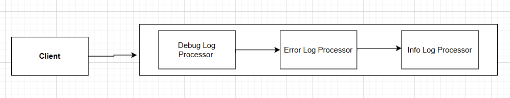

# All Behavioral Design Pattern

Guides How different Objects talk to each other effectively and distributes task efficiently, making software System flexible and easy to maintain.

1. State Design Pattern
2. Observer Design Pattern
3. Strategy Design Pattern
4. Chain of Responsibility Design Pattern
5. Template Design Pattern
6. Interpreter Design Pattern
7. Command Design Pattern
8. Iterator Design Pattern
9. Visitor Design Pattern
10. Mediator Design Pattern
11. Memento Design Pattern


### 1. State Design Pattern
Allow an object to alter its behavior when its internal state change.

```java
public class VendingMachine{
    VendingState vendingState;
    
    public VendingState getVendingMachineState(){
        return vendingState;
    }
    
    public void setVendingMachineState(VendingState state){
        this.vendingState=state;
    }
}

interface VendingState{ 
    void insertCoin(VendingMachine product);
    void dispatchItem(VendingMachine product);
}

public class IdleState implements VendingState{
    
    @Override
    void insertCoin(VendingMachine product){
        System.out.println("Coin Inserted");
        product.setVendingMachineState(new WorkingState());
    }
    
    @Override
    void dispatchItem(VendingMachine product){
        //
    }
}


public class WorkingState implements VendingState{
    
    @Override
    void inserCoin(VendingMachine vendingMachine){
        //
    }
    
    @Override
    void dispatchItem(VendingMachine product){
        System.out.println("Item Dispatched");
        // update to new State;
    }
}
```

### 2. Observer Design Pattern
In this object (Observable) maintains a list of its dependent object(Observer) and notify them of any change in its state.

```java
interface Observer {
    void update();
}

public class SMS implements Observer{
    
    @Override
    void update(){
        // Update
    }
}

public class whatsapp implements Observer{
    
    @Override
    void update(){
        // Update
    }
}

interface Observable{
    List<Observer> observers;
    
    void addObserver();
    void removeObserver();
    void notify();
    void setData();
}

public class ObservableImpl implements Observer{
    
    @Override
    void addObserver(){
        // add
    }
    
    @Override
    void removeObserver(){
        // remove
    }
    
    @Override
    void notify(){
        // notify
    }
    
    @Override
    void setData(){
        notify();
    }
}
```

### 3. Strategy Design Pattern
helps to define multiple algorithm for a task and we can choose any algorithm depending on the situation.

```java
public class ShoppingCart{
    
    List<Item> item;
    PayStrategy payObj;
    
    void pay(){
        payObj.pay();
    }
}


interface PayStrategy{
    
    void pay();
}

class CreditCardPay implements PayStrategy{
    @Override
    void pay(){
        // pay via Credit card
    }
}

class UPIPay implements PayStrategy{
    @Override
    void pay(){
        // pay via UPI
    }
}
class NetBankingPay implements PayStrategy{
    @Override
    void pay(){
        // pay via NetBanking
    }
}
```


### 4. Chain of Responsibility Design Pattern
Allow Multiple objects to handle the request without sender needing to know which object has processed the request.




```java
interface LogProcessor{
    
    LogProcessor nextLogProcessor;
    
    public LogProcessor(LogProcessor logProcessor){
        this.nextLogProcessor=logProcessor;
    }
    
    void log(String message){
        nextLogProcessor.log(message);
    }
}

public class ErrorLogProcessro implements LogProcessor{
    
    public ErrorLogProcessro(LogProcessor logProcessor){
        super(logProcessor);
    }
    
    @Override
    public void log(String message){
        if(i can Handle){
            // handle
        }
        else{
            super.log(message);
        }
    }
}

public class DebugLogProcessro implements LogProcessor{

    public DebugLogProcessro(LogProcessor logProcessor){
        super(logProcessor);
    }

    @Override
    public void log(String message){
        if(i can Handle){
            // handle
        }
        else{
            super.log(message);
        }
    }
}


public class Client{
    public static  void main(String[] args){
        LogProcessesor logProcessesor=new ErrorLogProcessro(new DebugLogProcessro(null));
        logProcessesor.log("messager");
    }
}
```


### 5. Template Design Pattern
When you want all classes should fallow the same steps to process a task but provide the flexibility that each classes can have their way of Implementation.

```java
interface PaymentFlow{
    void validate();
    void debitMoney();
    void calculateCharge();
    void creditMoney();
    
    public final void sentMoney(){
        validate();
        calculateCharge();
        debitMoney();
        creditMoney();
    }
}

public class PayToFriend implements PaymentFlow{
    
    @Override
    void validate(){
        // Pay to friend Validation
    }
    
    @Override
    void calculateCharge(){
        // pay to friend calculate charge
    }
    
    @Override
    void debitMoney(){
        // pay to friend debit money
    }
    
    @Override
    void creditMoney(){
        // pay to friend credit money
    }
}


public class PayToMerchant implements PaymentFlow{

    @Override
    void validate(){
        // Pay to Merchant Validation
    }

    @Override
    void calculateCharge(){
        // pay to Merchant calculate charge
    }

    @Override
    void debitMoney(){
        // pay to Merchant debit money
    }

    @Override
    void creditMoney(){
        // pay to Merchant credit money
    }
}


public class client{
    
    PaymentFlow paymentFlow=new PayToFriend();
    paymentFlow.sentMoney();
}
```

### 6. Interpreter Design Pattern
Interpret a expression base on a context

```java
interface AbstractExpression {

    int interpret(Context context);
}

public class NumberTerminalExpression implements AbstractExprassion {

    private String stringVal;

    public NumberTerminalExpression(String stringVal) {
        this.stringVal = stringVal;
    }

    @Override
    int interpret(Context context) {
        return context.getVal(stringVal);
    }
}

public class MultiplyTerminalExpression implements AbstractExprassion {

    private AbstractExpression left;
    private AbstractExpression right;

    public MultiplyTerminalExpression(AbstractExpression left, AbstractExpression right) {
        this.left = left;
        this.right = right;
    }

    @Override
    int interpret(Context context) {
        return left.interpret(context) * right.interpret(context);
    }
}

public class Context {
    Map<String, Integer> map;
    public Context(){
        map= new HashMap<>();
    }
    
    public void put(String key, int val){
        this.map.put(key, val);
    }
    
    public int getValue(String key){
        this.map.get(key);
    }
    
}

public class Client {
    public static void main(String[] args) {
        
        Context context=new Context();
        context.put("a", 1);
        context.put("b", 3);
        
        AbstractInterpreter abstractInterpreter = new MultiplyTerminalExpression(new NumberTerminalExpression("a"), new NumberTerminalExpression("b"));
        abstractInterpreter.interpret(context);
    }
}
```


### 7. Command Design Pattern
Terns request (Commands) into objects, allowing you to either parameterized or queue them.
this will help you to decouple the Sender and Receiver.

```java
public class AirConditioner{
    boolean turnOn;
    int temp;
    
    public void turnOn(){
        isOn=true;
    }
    
    public void turnOff(){
        isOn=false;
    }
    
    public void setTemp(int temp){
        this.temp=temp;
    }
}

interface ICommand{
    
    void execute();
}

public class TurnOnACCommand implements ICommand{
    
    AirConditioner airConditioner;
    
    public TurnOnACCommand(AirConditioner airConditioner){
        this.airConditioner=airConditioner;
    }
    
    @Override
    void execute(){
        airConditioner.turnOn();
    }
}

public class TurnOffACCommand implements ICommand{
    
    AirConditioner airConditioner;
    
    public TurnOffACCommand(AirConditioner airConditioner){
        this.airConditioner=airConditioner;
    }
    
    @Override
    void execute(){
        airConditioner.turnOff();
    }
}

public class RemoteControl{
    ICommand iCommand;
    
    public RemoteControl(){}
    
    public void setICommand(ICommand iCommand){
        this.iCommand=iCommand;
    }
    
    public void pressButton(){
        iCommand.execute();
    }
} 

public class Main{
    public static void main(String[] args){
        
        AirConditioner airConditioner=new AirConditioner();
        RemoteControl remoteControl=new RemoteControl();
        
        ICommand iCommand=new TurnOnACCommand(airConditioner);
        remoteControl.setICommand(iCommand);
        remoteControl.pressButton();
    }
}
```


### 8. Iterator Design Pattern
This provides a way to access element of a Collections sequentially without exposing the underlying representation of the collection. 

```java
public class Book{
    int id;
    String name;
    
    public Book(int id, String name){
        this.id=id;
        this.name=name;
    }
}

public interface Iterator{
    boolean hasNext();
    Object next();
}

public class BookIterator implements Iterator{
    
    int index=0;
    List<Book> books;
    
    public BookIterator(List<Book> books){
        this.books=books;
    }
    
    boolean hasNext(){
        return index<books.size();
    }
    
    Object next(){
        if(this.hasNext()){
            return books.get(index++);
        }
        return null;
    }
}

public class Library{
    List<Book> books;
    
    public Library(List<Book> books){
        this.books=books;
    }
    
    public Iterator createIterator(){
        return new BookIterator(this.books);
    }
}

public class Main{
    public static void main(String[] args){
        List<Book> books=List.of(new Book(1, "a"));
        Library library=new Library(books);
        Iterator iterator=library.createIterator();
        while(iterator.hasNext()){
            System.out.println(iterator.next());
        }
    }
}
```

### 9. Visitor Design Pattern
Allow adding new Operation to existing classes without modifying them and encouraging Open/Close Principle


```java
interface RoomElement{
    void accept(Visitor visitor);
}

public class SingleRoom implements RoomElement{
    
    int price;
    void accept(RoomVisitor visitor){
        visitor.visit(this);
    }
}

public class DoubleRoom implements RoomElement{

    int price;
    void accept(RoomVisitor visitor){
        visitor.visit(this);
    }
}

public class DuplexRoom implements RoomElement{

    int price;
    void accept(RoomVisitor visitor){
        visitor.visit(this);
    }
}

public interface RoomVisitor{
    
    void visit(SingleRoom singleRoom);
    void visit(DoubleRoom doubleRoom);
    void visit(DuplexRoom duplexRoom);
}

public class PriceCalculation implements RoomVisitor{
    
    @Override
    void visit(SingleRoom singleRoom){
        singleRoom.price=100;
    }
    
    @Override
    void visit(DoubleRoom doubleRoom){
        doubleRoom.price=170;
    }
    
    @Override
    void visit(DuplexRoom duplexRoom){
        duplexRoom.price=400;
    }
}

```


### 10. Mediator Design Pattern
It encourages loose coupling by keeping objects from referring to each other explicitly and allows them to talk to each other through a *Mediator*

Let take example of Auction

```java
import java.util.ArrayList;

public interface Colleague {

    void placeBid();

    void receiveNotification();
}

public class Bidder implements Colleague {

    String name;
    Mediator mediator;

    public Bidder(String name, Mediator mediator) {
        this.name = name;
        this.mediator = mediator;
        mediator.addBidder(this);
    }

    @Override
    void placeBid(int amount) {
        mediator.placeBid(this, amount);
    }

    @Override
    void receiveNotification(int amount) {
        // receive notification
    }
    
    public String getName(){
        return this.name;
    }
}

public interface AuctionMediator {
    void addBidder(Colleague bidder);

    void placeBid(Colleague bidder, int amount);
}

public class Auction implements AuctionMediator {

    List<Bidder> bidderList;

    public Auction() {
        this.bidderList = new ArrayList<>();
    }
    
    @Override
    void addBidder(Colleague bidder){
        this.bidderList.add(bidder);
    }
    
    @Override
    void placeBid(Colleague bidder, int amount){
        for(Colleague colleague: bidderList){
            if(!colleague.getName().equals(bidder.getName())){
                bidder.receiveNotification(amount);
            }
        }
    }
}
```

### 11. Memento Design Pattern

this have three component
1. **Originator:** This is object for which state need to saved or restored
2. **Memento:** This represents the object which hold the state of the originator
3. **CareTaker:** Manage the List of State.

```java
import java.util.ArrayList;

public class ConfigurationMemento {
    int height;
    int width;

    public ConfigurationMemento(int height, int width) {
        this.height = height;
        this.width = width;
    }
}

public class ConfigurationOriginator {
    int height;
    int width;

    public ConfigurationOriginator(int height, int width) {
        this.height = height;
        this.width = width;
    }

    public ConfigurationMemento createMoment() {
        return new ConfigurationMemento(this.height, this.width);
    }

    public void reverseConfiguration(ConfigurationMemento memento) {
        this.height = memento.height;
        this.width = memento.width;
    }
    
    public void setHeight(int height){
        this.height=height;
    }
    
    public void setWidth(int width){
        this.width=width;
    }
}

public class ConfigurationCaretaker {
    List<ConfigurationMemento> states = new ArrayList<>();
    
    public void addMomento(ConfigurationMemento memento){
        states.add(memento);
    }
    
    public ConfigurationOriginator undo(){
        if(states.size()>0){
            int lastIdx=states.size()-1;
            ConfigurationMemento memento=states.get(lastIdx);
            return memento;
        }
        return null;
    }
}

public class Main{
    public static void main(String[] args){
        
        ConfigurationCaretaker caretaker=new ConfigurationCaretaker();
        
        ConfigurationOriginator originator=new ConfigurationOriginator(5, 12);
        ConfigurationMemento memento=originator.createMoment();
        caretaker.addMomento(memento);
        
        originator.setHeight(34);
        
        momento=originator.createMoment();
        caretaker.addMomento(memento);
        
    }
}
```
