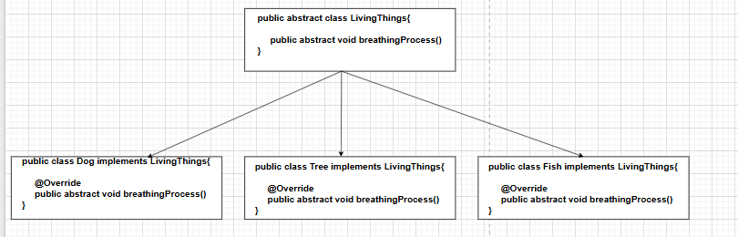
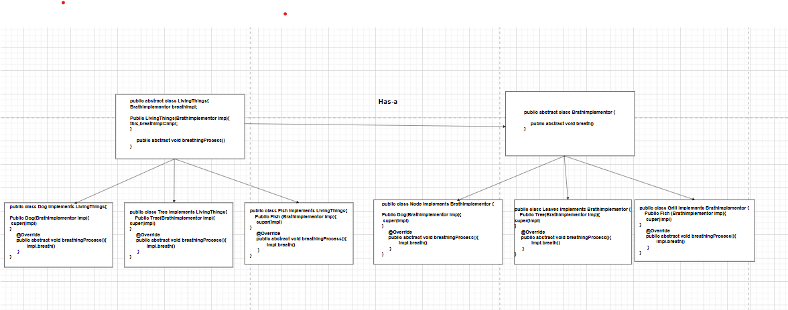

# Bridge Design Pattern

Bridge Design pattern decouple an abstraction from its implementation so that they can vary independently

In above example if we want to add a new type of like Bird then i have to make a new class where abstraction will grow

to solve this we came for Bridge
