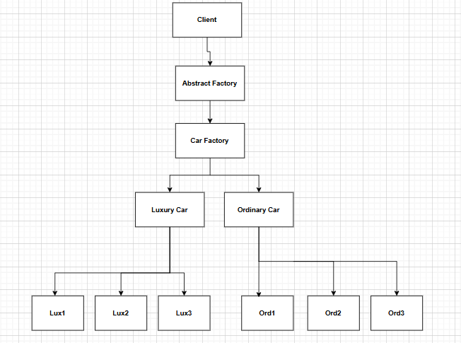

# Creational Design Pattern

Creation Design pattern responsible for creation of object/ control 


## Prototype Design Pattern

ProtoType design pattern use when we want to copy/clone the object.

## Singleton Design Pattern
Restrict the creation of object only one object is being share across the application.

### 1. Eager Initialization <br>
We create the object initially
```java
   public class DBConnection{
      private static DBConnection dbConnection=new DBConnection();
      private DBConnection(){}
   
      public static DBConnection getInstance(){
          return dbConnection;
      }
   } 
   ```

### 2. Lazy Initialization <br>
   We create object when ever it required
```java
public class DBConnection{
    private static DBConnection dbConnection;
    
    private DBConnection(){}
    
    public static DBConnection getInstance() {
        if (dbConnection==null){
            dbConnection=new DBConnection();
        }
        return dbConnection;
    }
}
```
*** there is a Problem with Lazy initialization as let suppose two thread trying access at the same time in this case two object will get created as both of them are trying to access.<br>
To Solved above problem Synchronized method came into picture


### 3. Synchronized Method <br>
Only one thread can access the method as that is Synchronized.
```java
public class DBConnection{
    public static DBConnection dbConnection;
    
    private DBConnection(){}
    
    synchronized public static DBConnection getInstance(){
        if(dbConnection==null){
            dbConnection=new DBConnection();
        }
        return dbConnection;
    }
}
```

### 4. Double Locking

Double check on object null

```java
public class DBConnection{
    
    public static DBConnection dbConnection;
    
    private DBConnection(){}
    
    public static DBConnection getInstance(){
        
        if(dbConnection==null){
            synchronized (DBConnection.class) {
                if (dbConnection == null) {
                    return dbConnection = new DBConnection();
                }
            }
        }
    }
}
```

## Factory Design Pattern

When all the object creation and its business logic we want to keep at one place


## Abstract Factory Design Pattern
Factory of factory

